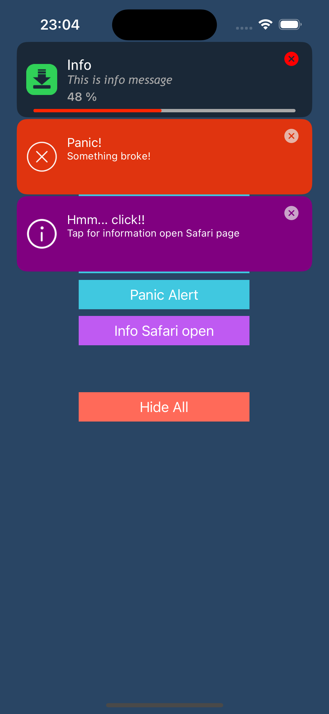

# APPPlainAlert
 The creeping message that enters the queue can be adjusted and customized from above or below
 
Notification message is fully customizable
Original Code from here https://github.com/josshad/EHPlainAlert

<p align="center">

</p>


## Example Success Alert
````objective-c  
- (IBAction)successAlert:(id)sender
{
	[APPlainAlert showAlertWithTitle:@"Success!!!!" message:@"Something works! Lorem ipsum-Something works! Lorem ipsum-Something works! Lorem ipsum-!\nLorem\nlorem" type:APPlainAlertSuccess];
	
	[APPlainAlert updatAPHidingDelay:5.0f];
}
````

## Example Info Alert
````objective-c  
- (IBAction)infoAlert:(id)sender
{
	APPlainAlert * APAlert = [[APPlainAlert alloc] initWithTitle:@"Info\n" message:@"This is info message" type:APPlainAlertInfo];
	APAlert.titleFont = [UIFont fontWithName:@"TrebuchetMS" size:15];
	APAlert.subTitleFont = [UIFont fontWithName:@"TrebuchetMS-Italic" size:12];
	APAlert.shouldShowCloseIcon = YES;
	APAlert.messageColorTitle=[UIColor blackColor];
	APAlert.messageColorSubtitle=[UIColor darkGrayColor];
	APAlert.iconColor=[UIColor blueColor];
	APAlert.hiddenDelay=20.f;
	APAlert.delegate=self;
	[APAlert show];

}
````

## Example Fail Alert
````objective-c  
- (IBAction)failureAlert:(id)sender
{
	NSError * error = [[NSError alloc] initWithDomain:@"www.appsyscode.com"
												 code:1337
											 userInfo:@{NSLocalizedDescriptionKey: NSLocalizedString(@"Operation was unsuccessful.", nil),
														NSLocalizedFailureReasonErrorKey: NSLocalizedString(@"The operation timed out.", nil),
														NSLocalizedRecoverySuggestionErrorKey: NSLocalizedString(@"Have you tried turning it off and on again?", nil)}];
	[APPlainAlert showError:error];
}

````

## Example Progres Alert
````objective-c  
- (IBAction)progressAlert:(id)sender
{
	progressAlert = [[APPlainAlert alloc] initWithTitle:@"Info" message:@"This is info message" type:APPlainAlertProgress];
	progressAlert.titleFont = [UIFont fontWithName:@"TrebuchetMS" size:17];
	progressAlert.subTitleFont = [UIFont fontWithName:@"TrebuchetMS-Italic" size:14];
	progressAlert.shouldShowCloseIcon = YES;
	progressAlert.messageColor=[UIColor clearColor];
	progressAlert.blurBackground=YES;
	progressAlert.messageColorTitle=[UIColor whiteColor];
	progressAlert.blurDarkEffect=YES;
	progressAlert.messageColorSubtitle=[UIColor lightGrayColor];
	progressAlert.iconColor=[UIColor whiteColor];
	progressAlert.hiddenDelay=100.f;
	progressAlert.delegate=self;
	progressAlert.progressTintColor=[UIColor lightGrayColor];
	progressAlert.progressTrackColor=[UIColor redColor];
	progressAlert.iconImage=[UIImage imageNamed:@"alert_download"];
	progressAlert.iconColor=[UIColor systemGreenColor];
	progressAlert.closebuttonColor=[UIColor redColor];
	[progressAlert show];
	[self downloadfile];

}

````
## Example Panic Alert
````objective-c  
- (IBAction)panicAlert:(id)sender
{
	[APPlainAlert showAlertWithTitle:@"Panic!" message:@"Something brokе!" type:APPlainAlertPanic];
	[APPlainAlert updatAPHidingDelay:10.0f];

}

````

## Example Alert Open Safari info
````objective-c  
- (IBAction)infoWithSafari:(id)sender
{
	APPlainAlert * APAlert = [[APPlainAlert alloc] initWithTitle:@"Hmm... click!!" message:@"Tap for information open Safari page" type:APPlainAlertInfo];
	APAlert.action = ^{
		UIApplication *application = [UIApplication sharedApplication];
		NSURL *URL = [NSURL URLWithString:@"https://appsyscode.com"];
		if ([application respondsToSelector:@selector(openURL:options:completionHandler:)]) {
		  [application openURL:URL options:@{}
			 completionHandler:^(BOOL success) {
		  }];
		}
	};
	APAlert.messageColor = [UIColor purpleColor];
	APAlert.iconImage = [UIImage imageNamed:@"alert_info"];
	[APAlert show];
}

````
## Author

appsyscode, info@appsyscode.com

## License

APPPAlert is available under the MIT license. See the LICENSE file for more info.
